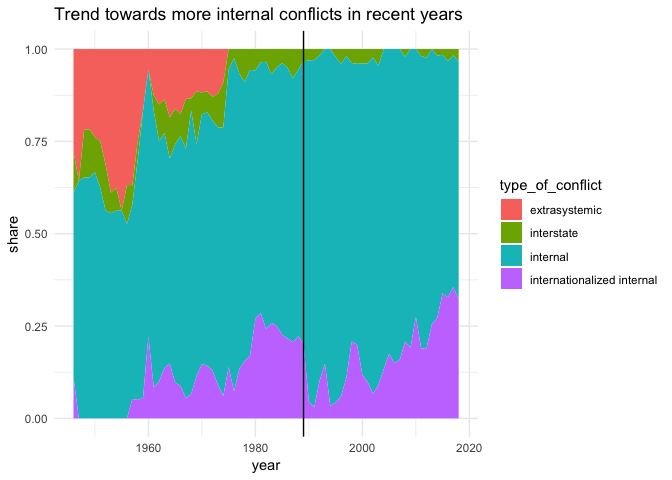

After the Cold War ended, the world hoped for an era of peace. But things turned out differently. Wars today are more complex than ever.

*In this repository, you will find the methodology, data and code behind the story that came out of this analysis.*

**Read the full article on DW.com:** [English](https://www.dw.com/a-51136876) | [German](https://www.dw.com/a-51120561) | [Indonesian](https://www.dw.com/a-51146003)

**Story by:** [Kira Schacht](https://twitter.com/daten_drang)

``` r
## install and load needs, if not yet present
# install.packages("needs")
library(needs)

# packages used in this markdown document
needs(tidyverse)
```

Read data
=========

Data for this project comes from the [Uppsala Conflict Data Program](https://ucdp.uu.se/downloads/index.html) by the Department of Peace and Conflict Research at Uppsala University. We'll use these two datasets:

-   *UCDP Dyadic Dataset version 19.1* ([Download](https://ucdp.uu.se/downloads/index.html#dyadic)): List of armed conflict by participants and year
-   *UCDP External Support in Non-state Conflict Dataset* ([Download](https://ucdp.uu.se/downloads/index.html#externalsupport)):List of external supporters of armed conflicts by participants, year, supporter and type of support

You'll also find a codebook containing information on each dataset column in the download link above.

For the analysis of military budgets, we'll use data collected by SIPRI and provided by the World Bank. ([Download](https://data.worldbank.org/indicator/MS.MIL.XPND.GD.ZS))

``` r
# List of armed conflict by participants and year
dyadic = readRDS("../data/ucdp-dyadic-191.rds")
dyadic[dyadic == ""] = NA #convert empty values to NA

# List of external supporters by participants, year, supporter and type of support
extsup = read.csv("../data/ucdp_extsup_large.csv", na="", stringsAsFactors = F)
```

Number of conflicts over time
=============================

Is there more conflict today than there used to be?
---------------------------------------------------

We'll count the number of conflicts over time and visualize them in an area chart. The UCDP differentiates between "wars" (at least 100 deaths per year) and "minor conflicts" (less than 100 deaths per year), which we'll do as well.

This information can be found in the column `intensity_level` in the `dyadic` dataset.

-   `1` = minor conflict
-   `2` = war

``` r
#create summarized dataset: year, intensity leve, number of conflicts
conf.count = dyadic %>%
    group_by(year, intensity_level) %>% #group by year and intensity
    summarise(n = length(unique(dyad_id))) %>% #count number of conflicts by intensity level per year
    mutate(intensity_level = factor(intensity_level, labels = c("minor conflict","war")) ) #change labels

#area chart: number of conflicts
ggplot(conf.count, aes(x=year, y=n, fill = intensity_level)) +
    geom_area() + geom_vline(xintercept = 1989) +
    ggtitle("Number of wars and minor conflicts over time") +
    theme_minimal()
```


``` r
#save chart
ggsave("../plots/conflict_count.png", device = "png", width = 16, height = 9, scale = 0.5)
ggsave("../plots/conflict_count.svg", device = "svg", width = 16, height = 9, scale = 0.5)
```

Further analysis
----------------

``` r
#number of conflicts in the past 10 years
dyadic %>% filter(year > 2009) %>%
    group_by(intensity_level) %>%
    summarise(n = length(unique(dyad_id)))
```

    ## # A tibble: 2 x 2
    ##   intensity_level     n
    ##             <int> <int>
    ## 1               1   162
    ## 2               2    23

``` r
#162 conflicts, 23 wars

#list of conflicts in 2018 by location
dyadic %>% filter(year == 2018) %>%
    group_by(location) %>%
    summarise(intensity_level = max(intensity_level)) %>%
    arrange(-intensity_level)
```

    ## # A tibble: 36 x 2
    ##    location                 intensity_level
    ##    <fct>                              <dbl>
    ##  1 Afghanistan                            2
    ##  2 Somalia                                2
    ##  3 Syria                                  2
    ##  4 Yemen (North Yemen)                    2
    ##  5 Algeria                                1
    ##  6 Burkina Faso                           1
    ##  7 Cameroon                               1
    ##  8 Central African Republic               1
    ##  9 Chad                                   1
    ## 10 Colombia                               1
    ## # … with 26 more rows

*FINDING:* conflicts have shot up again in the last decade

Complexity of conflicts
=======================

Have conflicts become more complex?
-----------------------------------

Meaning: are there, on average, more parties involved now than there used to be?

``` r
#create summarized dataset: year, mean number of parties per conflict

conf.complex = extsup %>% #external support data
    group_by(ywp_year, bwd_id) %>% #group by year and conflict ID
    summarise(inv = length(unique(external_name))) %>% #count number of parties per conflict per year
    group_by(ywp_year) %>% #group by year
    summarise(nparties = mean(inv), nconflicts = n()) #calculate mean number of parties per conflict

#line chart: mean complexity of conflicts over time
ggplot(conf.complex, aes(ywp_year, nparties)) + geom_line() + geom_vline(xintercept = 1989) + theme_minimal() +
    ggtitle("Mean complexity of conflicts over time") + labs(x="year",y = "mean no. of external parties involved")
```


*FINDING:* conflicts have become more complex since the 200s

Further analysis
----------------

The question for further analysis is which conflicts are especially complex. Has complexity increased around the globe or is there one group of conflicts causing the rise?

``` r
# are there specific wars that drag the average up?
# list the most complex wars since 2000:
extsup %>% filter(ywp_year >= 2000) %>%
    group_by(ywp_year, bwd_name) %>% #group by year and conflict
    summarise(nparties = length(unique(external_name))) %>% #number of external parties per conflict
    arrange(-nparties)
```

    ## # A tibble: 448 x 3
    ## # Groups:   ywp_year [10]
    ##    ywp_year bwd_name                                               nparties
    ##       <int> <chr>                                                     <int>
    ##  1     2003 Government of Iraq - Governments of USA, United Kingd…       46
    ##  2     2009 Government of Afghanistan - Taleban                          46
    ##  3     2008 Government of Afghanistan - Taleban                          44
    ##  4     2003 Government of Afghanistan - Taleban                          43
    ##  5     2009 Government of Afghanistan - Hizb-i Islami-yi Afghanis…       43
    ##  6     2007 Government of Afghanistan - Taleban                          41
    ##  7     2008 Government of Afghanistan - Hizb-i Islami-yi Afghanis…       41
    ##  8     2006 Government of Afghanistan - Taleban                          40
    ##  9     2004 Government of Afghanistan - Taleban                          34
    ## 10     2004 Government of Iraq - Al-Mahdi Army                           34
    ## # … with 438 more rows

*FINDING:* the wars in the Middle East are the most complex

Type of conflict over time
==========================

Have the kinds of conflicts changed over time?
==============================================

Info on the kind of conflict can be found in the `type_of_conflict` column in the `dyadic` dataset. This is the classification the UCDP uses:

-   `1` = extrasystemic (between a state and a non-state group outside its own territory, where the government side is fighting to retain control of a territory outside the state system).
-   `2` = interstate (both sides are states in the Gleditsch and Ward membership system).
-   `3` = internal (side A is always a government; side B is always a rebel group; there is no involvement of foreign governments with troops, i.e. there is no side\_a\_2nd or side\_b\_2nd coded).
-   `4` = internationalized internal (side A is always a government; side B is always a rebel group; there is involvement of foreign governments with troops, i.e. there is at least ONE side\_a\_2nd or side\_b\_2nd coded).

``` r
#create summarized dataset: year, type, number of conflicts
conf.type = dyadic %>%
    group_by(year, type_of_conflict) %>% #group by type and year
    summarise(n = length(unique(dyad_id))) %>% #count number of conflicts by type per year
    group_by(year) %>%
    mutate(share = n/sum(n), #calculate share of total number of conflicts per year
           type_of_conflict = factor(type_of_conflict, levels = 1:4,
                                     labels = c("extrasystemic","interstate","internal","internationalized internal"))) %>% #create prettier labels
    ungroup %>% complete(year, type_of_conflict, fill = list(n = 0, share = 0)) #add zero-value entries

#area chart: shares of conflict types over time
ggplot(conf.type, aes(x=year, y=share, fill = type_of_conflict)) +
    geom_area() + geom_vline(xintercept = 1989) +
    theme_minimal() +
    ggtitle("Trend towards more internal conflicts in recent years")
```



``` r
#Save chart
ggsave("../plots/conflict_type.png", device = "png", width = 16, height = 9, scale = 0.5)
ggsave("../plots/conflict_type.svg", device = "svg", width = 16, height = 9, scale = 0.5)
```

*FINDING:* there is a trend towards more internationalized internal conflicts

Military expenditure over time
==============================

How have the global military budgets changed over time?
-------------------------------------------------------

The data in the CSV is from the [SIPRI dataset](https://data.worldbank.org/indicator/MS.MIL.XPND.GD.ZS) mentioned above.

``` r
#read data
mil = read.csv2("../data/worldbank_military_expenditure_share_gdp_world.csv", stringsAsFactors = F)

#Line chart: Share of military expenditure in world GDP over time
ggplot(mil, aes(Year, military.expenditure.share)) +
    geom_line() + geom_vline(xintercept = 1989) +
    theme_minimal()
```

    ## Warning: Removed 1 rows containing missing values (geom_path).


``` r
#save chart
ggsave("../plots/conflict_military.png", device = "png", width = 16, height = 9, scale = 0.5)
```

    ## Warning: Removed 1 rows containing missing values (geom_path).

``` r
ggsave("../plots/conflict_military.svg", device = "svg", width = 16, height = 9, scale = 0.5)
```

    ## Warning: Removed 1 rows containing missing values (geom_path).

*FINDING:* relative military expenditure is at an all time low
